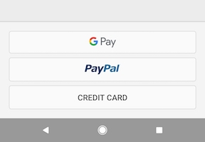

Setting up Google Pay™
==============

The Kite SDK comes with most of the [Google Pay API](https://developers.google.com/pay/api/android/guides/setup) setup already included, but it requires a few extra steps to be fully enabled for live purchases on your app.

Warning: Google Pay _will not work_ in production if your app id has not yet been whitelisted by the Google Pay API team, so do not release until all of these steps have been completed.

Steps
--------

1. Enable the Google Pay payment option in your KiteSDK `configureSDK()` setup method.

    ```
    private KiteSDK configureSDK(){
        ...
        KiteSDK.enableGooglePayPayment(true);
    }
    ```

    This will give you access to the Google Pay option on your payment screen:

    <p align="center">
      
    </p>

2. Complete the [Google Pay API Production Access Enablement Request Form](https://services.google.com/fb/forms/googlepayAPIenable/), with the your app/company details plus the following Kite payment details:

    - **Tokenization Method:** Gateway
    - **Payment Processor or Gateway:** Stripe

    Make sure you submit a version of your app that runs this using our TEST environment (`KiteSDK.DefaultEnvironment.TEST`).

3. Wait for the Google Pay API team to approve your app usage for Google Pay. Google will probably request a production version of the app after this, this may include a test purchase so be prepared to cancel the order from your [Kite dashboard](https://www.kite.ly/orders/) if this happens.

4. Hooray! Go ahead and release with Google Pay.
        
        
Prerequisites
--------
In order to use Google Pay, you'll need to ensure you're using the Kite SDK v5.8.9 or above.
