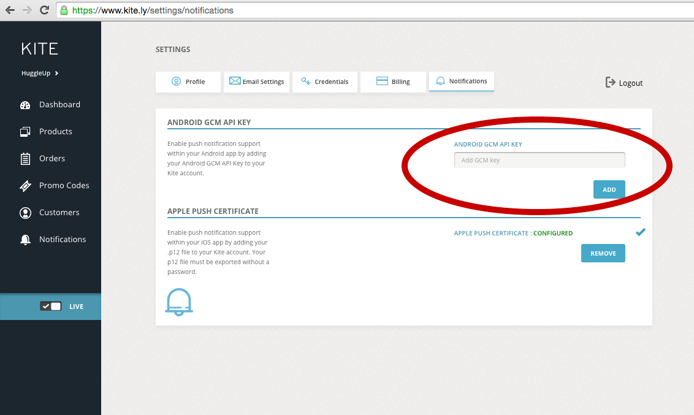

# Configuring Push Notifications

Push notifications are a powerful marketing tool that if used effectively can increase both user engagement and customer life time value by driving more sales within your application. Kite supports sending push notifications to your customers with a bit of configuration.


## Overview

In order to set up push messaging, you will need to perform the following steps:

1. Set up Google Cloud Messaging (GCM)
2. Add Kite SDK and GCM modules to your app
3. Create a push notification action


## Set up Google Cloud Messaging (GCM)

Kite push notifications on Android make use of the Google Cloud Messaging framework. It is necessary, therefore, to set up Google Cloud Messaging before adding push notifications to your app.

Log in to Google's [API Console](https://console.developers.google.com/). If you do not already have a Google account, create one now.

If you have not already created a project, click on **Create Project** to create a new one.

When you have created a project, the console's dashboard will be displayed. Make a note of the **project number** near the top of the page - this 12-digit number will be your **Google Sender Id**, which you will need to include in your app as a string resource later.

From the Google Developer's Console dashboard, choose the **APIs** section under **APIs & auth** from the left-hand navigation menu.

In the list of APIs, look for **Google Cloud Messaging for Android**, and enable it by clicking the switch at the top of the page. Click **Credentials** under **APIs & auth**. Under the **Public API access** section, click on the **Create new Key** button. A dialog will appear that asks you which type of key you wish to generate; you should select the **Android key**.

Once you have obtained an API key, you should log in to the [Notification](https://www.kite.ly/settings/notifications) section of the Kite Dashboard and enter the key into the Android GCM API Key field.




## Add Kite SDK and GCM modules to your app

The components required to implement push messaging are contained within the **KitePrintSDK-GCM** module in the **Android-Print-SDK** repository.

To incorporate push messaging in your app, you can either copy the dependencies and components in the KitePrintSDK-GCM module into your app directly, or build your app using the Kite SDK source. These instructions inform you how to build from the source.

On your build machine, change into the directory in which you wish to place the Kite SDK repository.

```
cd <path-to-your-directory>
```


Clone the Kite SDK into this directory.

```
git clone https://github.com/OceanLabs/Android-Print-SDK.git
```


Open your app project in **Android Studio**.

Ensure that your *project* `settings.gradle` file contains the relevant lines:

```
include <your-app-modules-listed-here>, ':KitePrintSDK', ':KitePrintSDK-GCM'
project(':KitePrintSDK').projectDir = new File('<relative-path-to-the-KitePrintSDK-module>')
project(':KitePrintSDK-GCM').projectDir = new File('<relative-path-to-the-KitePrintSDK-GCM-module>')
```

For example:

```
include ':MyAppModule', ':KitePrintSDK', ':KitePrintSDK-GCM'
project(':KitePrintSDK').projectDir = new File('../Android-Print-SDK/KitePrintSDK')
project(':KitePrintSDK-GCM').projectDir = new File('../Android-Print-SDK/KitePrintSDK-GCM')
```


Ensure that your *app module* `build.gradle` file contains the relevant dependencies:

```
dependencies {
    ...
    compile project(':KitePrintSDK')
    compile project(':KitePrintSDK-GCM')
    ...
}
```


Ensure that your app `AndroidManifest.xml` contains the following permissions:

```
    <permission android:name="<your-app-package>.permission.C2D_MESSAGE" android:protectionLevel="signature" />

    <uses-permission android:name="<your-app-package>.permission.C2D_MESSAGE"/>

```

Also ensure that the `AndroidManifest.xml` contains the following declarations. Notice that the service declaration is for a listener service. The name should be adjusted to match the package and class name that you use. A template class is provided in the **SampleApp** module included with the Kite SDK.

```
    <application
        ...>

        ...

        <receiver
            android:name="com.google.android.gms.gcm.GcmReceiver"
            android:exported="true"
            android:permission="com.google.android.c2dm.permission.SEND" >
            <intent-filter>
                <action android:name="com.google.android.c2dm.intent.RECEIVE" />
                <category android:name="<your-app-package>" />
            </intent-filter>
        </receiver>

        <service
            android:name=".GCMListenerService"
            android:exported="false" >
            <intent-filter>
                <action android:name="com.google.android.c2dm.intent.RECEIVE" />
            </intent-filter>
        </service>

        ...

    </application>
```

Add your **Google Sender Id** as a string resource. Remember from earlier that this is the 12-digit project number from the Google API Console.

```
    <resources>

        ...

        <string name="gcm_sender_id">your-12-digit-project-number</string>

        ...

    </resources>
```

### Call the GCM registration service from your app

The ```GCMRegistrationService``` class in the **Kite-GCM** module takes care of obtaining a Google Cloud Messaging token, and registering it with the Kite servers.

Where appropriate in your app, start the registration service as follows:

```
GCMRegistrationService.start( this );
```

You do not need to keep track of whether you have already called this, or whether registration succeeded, as the service automatically takes care of this for you.


## Create a push notification action

Once a push notification has arrived, you must decide what to do with it. Often an app will create an Android notification to display the message to the user. Alternatively, you may choose to parse the message and perform an app action. However you decide to handle the notification, you must implement a listener service. As mentioned previously, a template is provided in the SampleApp module, but your implementation may look something like this:

```
...

import android.app.Notification;
import android.app.NotificationManager;
import android.app.PendingIntent;
import android.content.Context;
import android.content.Intent;
import android.content.SharedPreferences;
import android.os.Bundle;
import android.preference.PreferenceManager;
import android.util.Log;

import com.google.android.gms.gcm.GcmListenerService;


public class GCMListenerService extends GcmListenerService
  {
  ////////// Static Constant(s) //////////

  @SuppressWarnings( "unused" )
  private static final String  LOG_TAG         = "GCMListenerService";

  private static final int     REQUEST_CODE    = 10;
  private static final int     NOTIFICATION_ID = 11;


  ...

  @Override
  public void onMessageReceived( String from, Bundle data )
    {
    String message = data.getString( "message" );

    Log.d( LOG_TAG, "From: " + from );
    Log.d( LOG_TAG, "Message: " + message );


    // We don't do anything with topics at the moment, so every message is assumed
    // to be a normal downstream message.


    // Check if the user is OK to receive notification messages

    ...


    // Create a notification


    // We want to go into the home activity when the notification is clicked

    Intent intent = new Intent( this, MainActivity.class );

    PendingIntent pendingIntent = PendingIntent.getActivity( this, REQUEST_CODE, intent, PendingIntent.FLAG_CANCEL_CURRENT );


    Notification.Builder notificationBuilder = new Notification.Builder( this );

    notificationBuilder
            .setSmallIcon( R.drawable.ic_notification )
            .setContentTitle( getString( R.string.app_name ) )
            .setContentText( message )
            .setContentIntent( pendingIntent )
            .setAutoCancel( true );


    NotificationManager notificationManager = (NotificationManager)getSystemService( Context.NOTIFICATION_SERVICE );

    notificationManager.notify( NOTIFICATION_ID, notificationBuilder.getNotification() );
    }

  ...
  }
```

